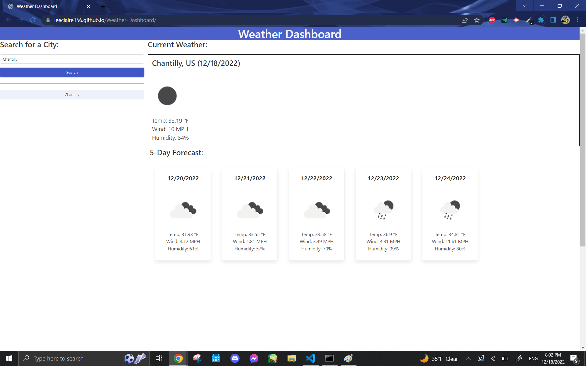
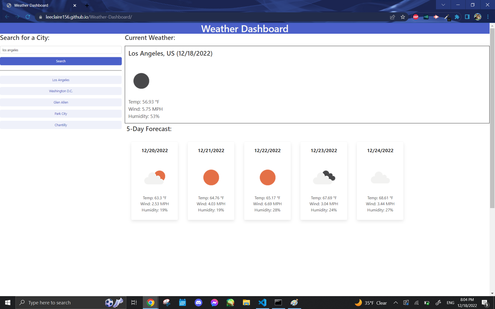
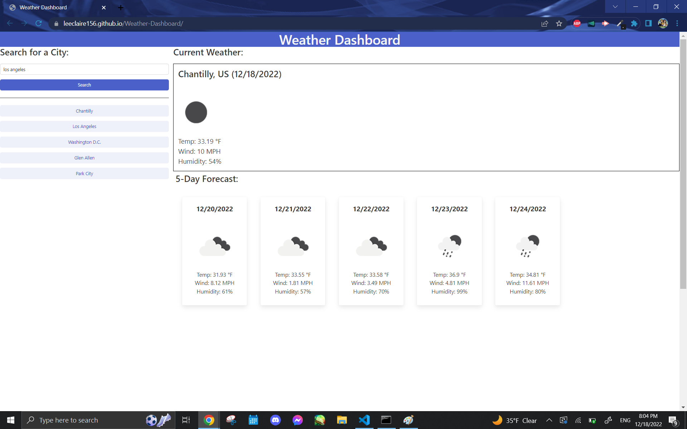

# Weather-Dashboard

## Description
This project allows users to look at a five day forecast for the city of their choice using a third party API, OpenWeatherMap. This project also utilizes a CSS library, Bulma, to provide quick CSS work. This application allows the user to look at the current and upcoming five days of weather. The weather information that will display are the temperature (in Fahrenheit), wind speed (in miles per hour, denoted as MPH), and humidity (%). There will also be an icon that represents the corresponding weather conditions.

## Usage
* Please click on the following link of the deployed website, https://leeclaire156.github.io/Weather-Dashboard/

* The application should appear as so on screens upon load if the user has never used the application:
 

* The application should appear as so on screens upon load if the user has previously used the application:
 

* When the user looks up a city, a button with the city's name is created under the search input area and both the current weather along with its upcoming five day forecast will be displayed on the right side of the search area.

* The application will save the last 5 queries.

* Hovering over the past query buttons will changes the color slightly.

* Clicking on the button will display the current weather and its forecast again, as well as making a new history button under the search area.

## Credits and Tutorials Followed
* Bulma Integration and Styling Tutorials provided by [The Net Ninja](https://www.youtube.com/@NetNinja):   https://www.youtube.com/watch?v=SCSAExGFK1E&list=PL4cUxeGkcC9iXItWKbaQxcyDT1u6E7a8a

* Horizontal divider tutorial by [W3Schools](www.w3schools.com):  
https://www.w3schools.com/howto/howto_css_dividers.asp

* Obtaining date from dt property in weather object credit goes to [mplungjan](https://stackoverflow.com/users/295783/mplungjan) and [Open Weather Map's API documentation](https://openweathermap.org):  
https://stackoverflow.com/questions/62376115/how-to-obtain-open-weather-api-date-time-from-city-being-fetched
   
https://openweathermap.org/current

* Converting date credit goes to [samnu pel](https://stackoverflow.com/users/6499984/samnu-pel):  
https://stackoverflow.com/questions/46228846/how-to-format-javascript-date-to-mm-dd-yyyy

* Credit for using +=8 increment to increase loop for displaying the following five days belongs to [Alvaro Gomez](https://www.youtube.com/@sick911):  
https://www.youtube.com/watch?v=j2fGspauwD4

* Clicking button to provide its name and only allowing buttons to be clicked in the past queries/history button list area credit goes to [Aliaksandr Sushkevich](https://stackoverflow.com/users/7600492/aliaksandr-sushkevich):  
https://stackoverflow.com/questions/49680484/how-to-add-one-event-listener-for-all-buttons

* Adding multiple classes with classList.add() method credit goes to [iwege](https://stackoverflow.com/users/809744/iwege):  
https://stackoverflow.com/questions/11115998/is-there-a-way-to-add-remove-several-classes-in-one-single-instruction-with-clas

* Centering an image in Bulma credit goes to [Merbin J Anselm](https://stackoverflow.com/users/4486804/merbin-j-anselm):  
https://stackoverflow.com/questions/48277473/center-image-in-bulma

* Bulma tutorials were referenced from Bulma's documentation:  
 https://bulma.io/documentation/

 * JSON.parse/stringify supplementary lesson supplied by [W3Schools](https://www.w3schools.com/):  
https://www.w3schools.com/js/js_json_intro.asp

* JSON.parse/stringify supplementary lesson supplied also by [LogRocket](https://logrocket.com/):  
https://blog.logrocket.com/storing-retrieving-javascript-objects-localstorage/

* Storage and display functions credit goes to [James Q Quick's](https://www.youtube.com/@JamesQQuick) tutorials:  
https://www.youtube.com/watch?v=DFhmNLKwwGw&list=PLDlWc9AfQBfZIkdVaOQXi1tizJeNJipEx&index=9
https://www.youtube.com/watch?v=jfOv18lCMmw&list=PLDlWc9AfQBfZIkdVaOQXi1tizJeNJipEx&index=10

* Input key event supplementary lessons supplied by [MDN Web Docs](https://developer.mozilla.org/en-US/):  
https://developer.mozilla.org/en-US/docs/Web/Events
https://developer.mozilla.org/en-US/docs/Web/HTML/Element/input/text

* Local storage explanation supplied by [FolksTalk](https://www.folkstalk.com/):  
Note: Unfortunately the original article does not seem to exist any longer; regardless, the credit stated here shall remain in acknowledgment.
https://www.folkstalk.com/2022/09/how-push-objects-into-a-local-stotage-array-with-code-examples

* Special thanks for the nullish coalescing operator (??) operator supplementary lesson supplied by [Michael Karén](https://michael-karen.medium.com/):   
https://michael-karen.medium.com/how-to-save-high-scores-in-local-storage-7860baca9d68

* array.map() method supplementary lesson supplied by [MDN Web Docs](https://developer.mozilla.org/en-US/):  
https://developer.mozilla.org/en-US/docs/Web/JavaScript/Reference/Global_Objects/Array/map
